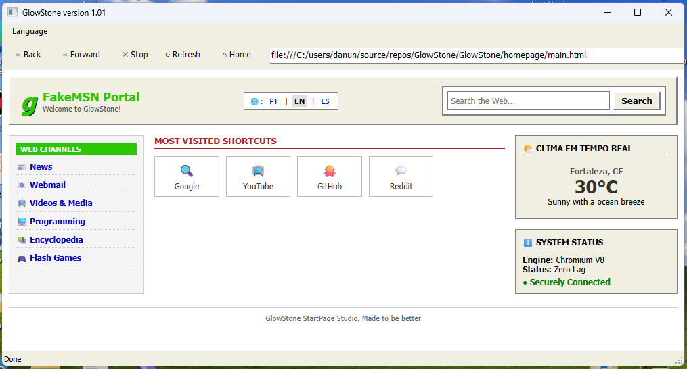
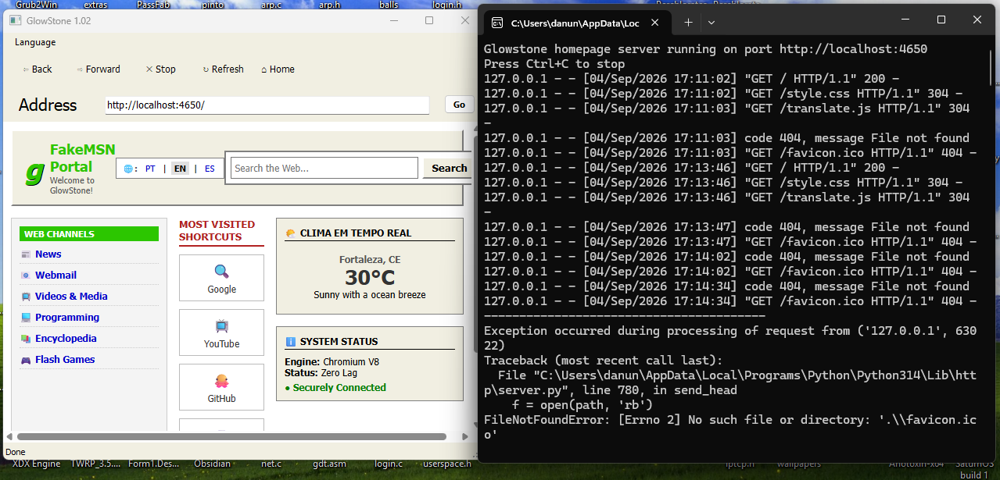

  

<h3 align = "center">
  GlowStone
</h3>

GlowStone is a stable version of Internet Explorer with source-code don't based on IE

### WARNING
You need install WebView2 to run and edit this browser

### Overview

If you want to see original browser repository
https://github.com/Danoni631/GlowStone-Browser
